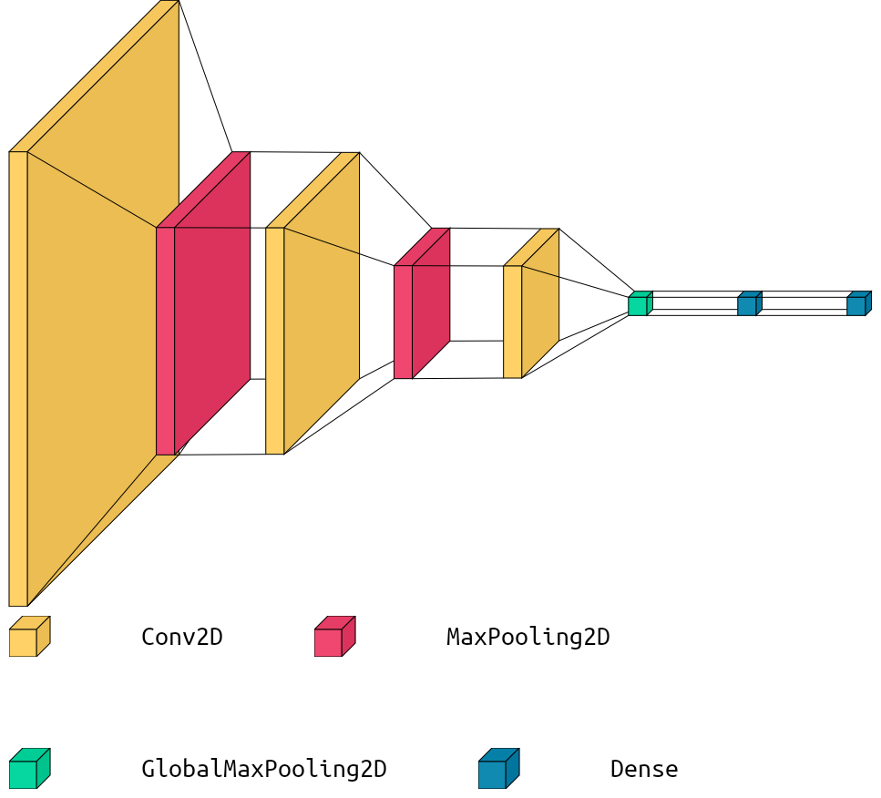

## BASEDNet - BASEline Discriminator Network

---

As part of the CSE Early Research Scholars Program, our group developed **BASEDNet**, a Convolutional Neural Network that scores baseline predictions for historical documents on a holistic basis. The network itself is implemented as a Binary Image Classifier, and it acts as a discriminator between 'good' and 'bad' baseline predictions. The model itself is defined and trained within `train.py`. Further, with the trained model, we also use a gradient-based decoder to optimize 'bad' baseline predictions with respect to two scores -- the holistic goodness score produced by BASEDNet, and another goodness score produced by `dhSegment`, a model that generates baseline predictions for historical documents.